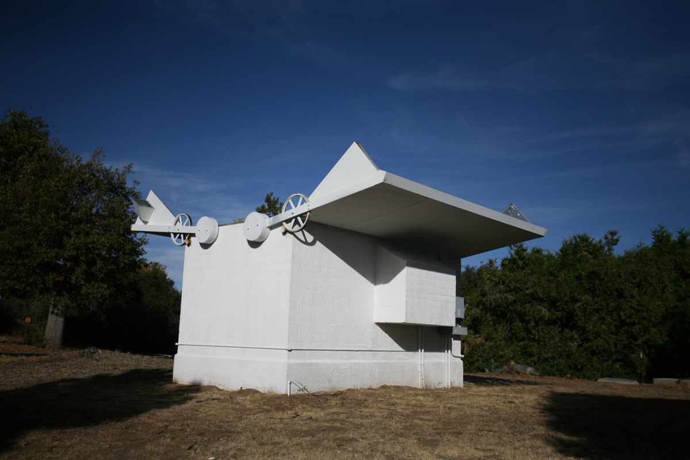
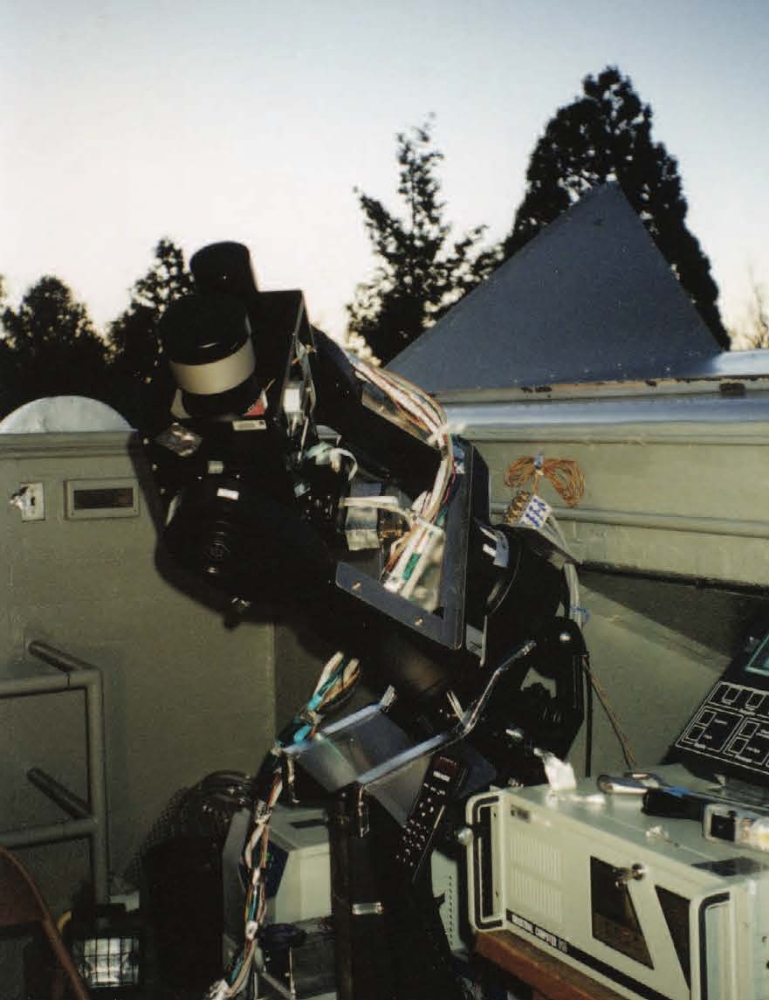

<!--
TODO:
tags: [TrES, Sleuth, Palomar, astronomy, Caltech]
-->

*This article was originally published in
[The Big Eye Newsletter](http://www.astro.caltech.edu/palomar/community/friends/bigeye.html)
([Vol 1 No 2](http://www.astro.caltech.edu/palomar/community/friends/newsletter/BigEye1-2.pdf),
Spring 2006).*

A new visitor to the
[Palomar Observatory](http://www.astro.caltech.edu/palomar/homepage.html)
would be forgiven for paying scant attention to the small hut-like
structure shown in [Figure 1](#fig1). A few minutes walk from the gigantic dome of the
five-meter (200-inch)
[Hale Telescope](http://www.astro.caltech.edu/palomar/about/telescopes/hale.html),
the clamshell enclosure houses a small telescope named [Sleuth](../sleuth.html). The
diameter of Sleuth's camera lens is relatively small, only 10 cm. The
telescope itself would blend in well in a store for the astronomy
enthusiast. And yet, this inconspicuous telescope is contributing to
our understanding of planetary systems similar to our solar system,
and how these systems formed. In the shadow of the "Big Eye", this is
the Little Telescope That Could.

  
<small>
*<b id="fig1">Figure 1</b>: Sleuth - the smallest telescope at the Palomar Observatory*
</small>

The planets in our own solar system have intrigued humanity throughout
history. In particular, we strove for the ability to predict the
motion of these "wanderers" in the night sky. Great minds provided
keen insights into the workings of the solar system. These included
Copernicus' bold statements that displaced Earth from the center of
the universe, and Newton's theory of gravity that explained why the
planets perform their dance around the Sun. We now probe our solar
system and beyond for clues as to how a planetary system forms and
what the composition of a planet may be. Since the discovery 10 years
ago of the first planets outside the solar system (called exoplanets),
we have identified about 160 of these bodies[1](#f1). We
hope to discover other "Earths" – a holy grail in astronomy.

Rather than trying to observe a planet itself directly, it is easier
to discover an exoplanet by observing the effect of the planet on the
host star. As a gas giant like Jupiter orbits a star, the star may
appear to "wobble" by a certain amount in the night sky. If we observe
such a wobbling star, we can estimate the mass of the companion and
deduce that a planet may be present. The majority of known exoplanets
were identified in this way. These discoveries included a surprise
finding: gas giants can be found closer to stars than Mercury is to
the Sun! This proximity also means that it is likely that we can
observe the planet crossing in front of or "transiting" the star, as
is seen during transits of Mercury and Venus. If this happens, the
star appears to dim for a few hours. Because of the relative diameters
of a star like the Sun and a Jupiter-like planet, this dip in the
brightness (about one percent) of the star could be detected even by a
small telescope (if you were careful with how you measured this
brightness). In 1999, the first transiting exoplanet
[HD 209458 b](https://en.wikipedia.org/wiki/HD_209458_b) was
discovered using the 10-cm
[STARE](http://www.hao.ucar.edu/research/stare/stare.html) (STellar
Astrophysics & Research on Exoplanets) telescope. Eight other
transiting exoplanets
are now known[2](#f2).

Sleuth (shown in [Figure 2](#fig2)) is a small-aperture telescope, similar to that used 
to discover HD 290458 b. Its 10-cm camera lens has a large square field of view on
the night sky, about six degrees to a side. (The diameter of the moon
on the sky is about half a degree.) The construction of the telescope
by
[Professor David Charbonneau](https://www.cfa.harvard.edu/~dcharbon/Site/Welcome.html)
(currently at the [Center for Astronomy](https://www.cfa.harvard.edu/)
at Harvard University) was completed in 2003. Since then, Sleuth has
observed a new patch of sky throughout each night every two to three
months[3](#f3). At the end of this observing run,
the brightness of each of the thousands of stars is studied for signs
of a transit dip. Any candidates must then be confirmed by observing
them with various instruments on larger telescopes before any
announcement can be made with certainty. Ultimately, the mass of the
planet must be measured from the wobble of the host star. In the case
of a transiting planet, the estimate of the mass of the planet from
the wobble of the star is very close to the actual mass, so we can
confirm the planetary mass of
the candidate.

  
<small>
*<b id="fig2">Figure 2</b>*
</small>

Despite its location in sunny Southern California, Palomar Mountain
can be a cold, windy experience for observers at night, especially
during winter. And without the shelter available in the larger domes,
regularly observing in Sleuth's clamshell enclosure requires passion,
discipline, and lots of layered clothing!  Thankfully, the frostbitten
fingertips of graduate students need not be sacrificed in the name of
science. Sleuth is an automated telescope, capable of observing target
areas of the night sky without much human supervision. All the
required actions are scripted in advance, and a computer running this
script is placed in charge of the telescope. The observer can then get
a good night's sleep and receive the data in the morning. The
automated nature of this procedure allows for remote observing, so the
observer need not even be on the mountain. In this way, Sleuth is
controlled from the California Institute of Technology
([Caltech](http://www.caltech.edu/)) in Pasadena,
and can observe each night, weather permitting.

Unfortunately, the weather on the mountain does not always cooperate
with our plans. Fortunately, Sleuth is part of an international
network of three telescopes, the Transatlantic Exoplanet Survey
([TrES](../index.html), 
the Spanish for “three”). The telescopes are located in California,
Arizona and Tenerife, Spain. Observation of the same area of the sky
with each of the telescopes allows for continuous monitoring even if
weather shuts down one of the telescopes. In 2004, this TrES
collaboration announced the discovery of the closest planet to have
been identified by its transits of a star. The planet, cleverly
denoted by the name [TrES-1](https://en.wikipedia.org/wiki/TrES-1b),
lies over 500 light-years away. Despite this distance, the TrES group
was able to detect infrared emission from this planet–the first direct
observation of light from an exoplanet. Several of the other known
transiting planets are much further away than TrES-1, beyond the reach
of current follow-up facilities, so this planet produces a valuable
opportunity to study the structure of exoplanets and the composition
of their atmospheres.

Many hours of work by professional astronomers were spent before the
discovery of TrES-1. But any enthusiast can find the host star (at
[19h 04m 10s +36d 37m 57s](http://www.sky-map.org/?ra=19.0694&de=36.63265&zoom=8&show_grid=1&show_constellation_lines=1&show_constellation_boundaries=1&show_const_names=0&show_galaxies=1&show_box=1&box_ra=19.0694&box_de=36.63265&box_width=50&box_height=50&img_source=DSS2),
J2000) and observe it using amateur telescopes similar to
Sleuth. Indeed, many amateur astronomers are joining the hunt for
transiting planets as part of the
[transitsearch.org](http://transitsearch.org/) network. If you too can
escape the light pollution, I invite you to enjoy the night sky, and
think of Sleuth, the tireless workhorse, quietly studying thousands of
stars for signs of TrES-2, -3 and maybe even -4[4](#f4), and providing the
foundation for the discovery of other Earths.

<b id="f1">1</b> [3443](http://exoplanet.eu/) exoplanets
are known as of 2016-06-30. [↩](#a1)  
<b id="f2">2</b> [2628](http://exoplanet.eu/) transiting
exoplanets are known as of 2016-06-30. [↩](#a2)  
<b id="f3">3</b> Sleuth went out of service in 2007, and
was
[retired](http://palomarskies.blogspot.com/2009/10/goodbye-to-sleuth.html)
in 2009. [↩](#a3)  
<b id="f4">4</b>
[TrES-2](https://en.wikipedia.org/wiki/TrES-2b),
[TrES-3](https://en.wikipedia.org/wiki/TrES-3b),
[TrES-4](https://en.wikipedia.org/wiki/TrES-4b), and 
[TrES-5](http://exoplanet.eu/catalog/tres-5_/), have indeed been
discovered. [↩](#a4)  
